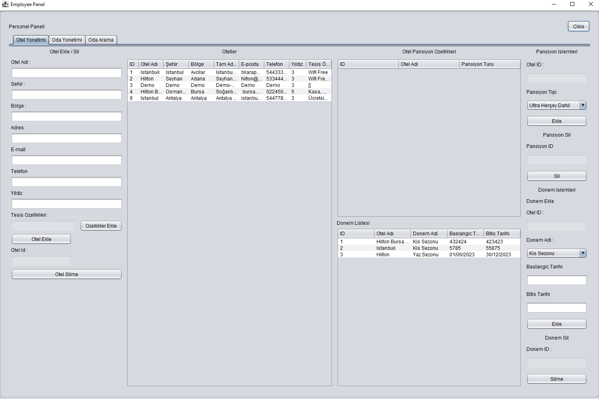

# Tourism-Agency-System

## Profect Information Video
[](https://www.youtube.com/watch?v=lxHag4FNKws)
## Installation
    Java 11 or higher version is required to run.
    Maven 3.6.3 or higher version is required to run.
    Mysql 8.0.23 or higher version is required to run.


## Installation Sql
``` sql
( create table features
(
id   int auto_increment
primary key,
type enum ('tesis ozelligi', 'oda ozelligi', 'pansiyon ozelligi', 'sezon ozellikleri') null,
name varchar(255)                                                                      null
);

create table lodgings
(
id      int auto_increment
primary key,
otel_id int                                                                                                                                      not null,
type    enum ('Ultra Herşey Dahil', 'Herşey Dahil', 'Oda Kahvaltı', 'Tam Pansiyon', 'Yarım Pansiyon', 'Sadece Yatak', 'Alkol Hariç Full Credit') not null
);

create table otel
(
id       int auto_increment
primary key,
name     varchar(255) not null,
region   varchar(255) not null,
city     varchar(255) not null,
address  varchar(255) not null,
`e-mail` varchar(255) not null,
phone    varchar(11)  not null,
star     int          not null,
features varchar(255) not null
);

create table room
(
id          int auto_increment
primary key,
otel_id     int                                                                                           not null,
lodgings_id int                                                                                           not null,
season_id   int                                                                                           not null,
price_child int                                                                                           not null,
features    varchar(255)                                                                                  not null,
name        varchar(255)                                                                                  not null,
stock       int                                                                                           not null,
bed_number  int                                                                                           null,
sqr_meter   int                                                                                           null,
room_type   enum ('SINGLE', 'DOUBLE', 'TRIPLE', 'FAMILY', 'KING', 'DISABLED', 'JUNIOR', 'DUBLEX', 'SUIT') null,
price_adult int                                                                                           null
);

create table season
(
id         int auto_increment
primary key,
otel_id    int          not null,
start_date varchar(255) not null,
end_date   varchar(255) null,
name       varchar(255) null
);

create table tourism_agency_user
(
id       int auto_increment
primary key,
username varchar(255)               not null,
password varchar(255)               not null,
type     enum ('admin', 'employee') not null,
name     varchar(255)               not null
);
```
## Project Description
    Iki farkli kullanicinin bulundugu bir turizm acentesi sistemi. 
    Birinci kullanicinin admin yetkisi vardir.
    Bu kullanicilar otel, oda, pansiyon, sezon ve ozelliklerini ekleyebilir, duzenleyebilir ve silebilir. Ikinci kullanicilar ise bu verileri goruntuleyebilir ve rezervasyon yapabilirler.
    
    admin kullanici adi: a`
    admin sifre: a`
    employee kullanici adi: t`
    employee sifre: t`
    
    Iki ana sayfa bulunmaktadir. 
    Birincisi admin sayfasidir.Bu sayfada admin kullanicisi kullanici olusturma ve duzenleme islemlerini yapabilir. Ayni zamanda admin kullanicisi
    Ikinci sayfa ise employee sayfasidir. Otel, oda, pansiyon, sezon ve ozelliklerini ekleyebilir, duzenleyebilir ve silebilir. 
    Bu sayfada employee kullanicisi otel, oda, pansiyon, sezon ve ozelliklerini goruntuleyebilir ve rezervasyon yapabilirler.


## Project Images




